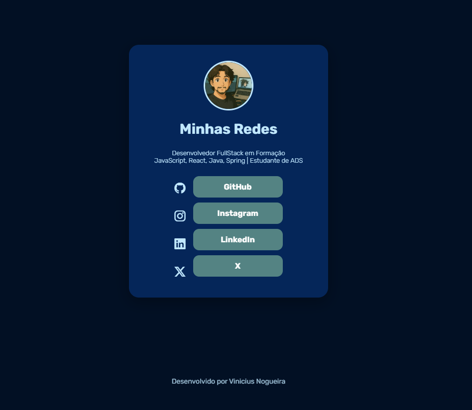

# 📦 LinkBox

LinkBox é um projeto pessoal inspirado no Linktree. A ideia é criar uma página simples, bonita e responsiva para centralizar links de redes sociais e portfólio.

Este projeto está sendo desenvolvido com **HTML**, **CSS** e **JavaScript**, com foco em praticar front-end e criar algo útil para uso pessoal.

---

## 🧪 Status do Projeto

🚧 **Em desenvolvimento** – Esta é a versão **1.0.0**.  
O projeto ainda está sendo atualizado com novas funcionalidades, estilos e melhorias. Fique à vontade para acompanhar as mudanças e sugerir ideias!

---

## ✨ Tecnologias utilizadas

- HTML5
- CSS3
- JavaScript
- Font Awesome (para ícones)
- Google Fonts - [Rubik](https://fonts.google.com/specimen/Rubik)

---

## 📸 Preview

 

*(https://link-box-vinicassaos-projects.vercel.app/)*

---

## 🛠 Funcionalidades

- Página de links personalizada
- Ícones sociais com estilo moderno
- Layout responsivo

---

## 📌 Próximas melhorias

- [ ] Modo escuro / claro
- [ ] Adição de animações suaves
- [ ] Campo dinâmico para adicionar novos links

---

## 👨‍💻 Desenvolvedor

Projeto feito com vontade de evoluir, aprender e construir algo útil 🌱🚧  
Desenvolvido por **[Vinicius Nogueira]**  
[LinkedIn](https://www.linkedin.com/in/vinicius-nogueira-cass%C3%A3o/)

---

